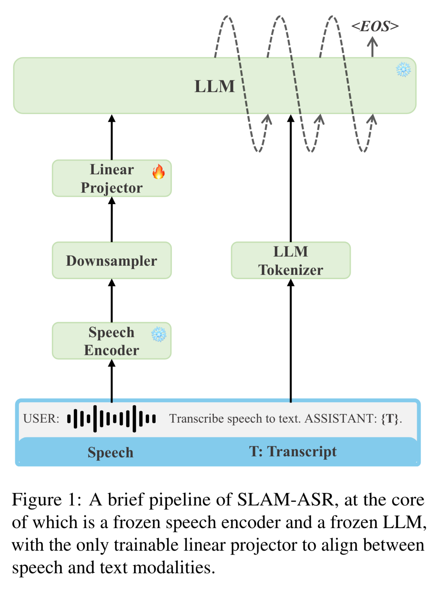

# ASR_Librispeech

## Model Architecture

The proposed SLAM-ASR provides a clean setup and little task-specific design, where only the linear projector is trained. Refer to the [**paper**](https://arxiv.org/abs/2402.08846) for more details. 



## Performance and checkpoints
We only train the linear projector in this recipe.
Encoder | Projector | LLM | test-clean | test-other
|---|---|---|---|---
[WavLM-large](https://drive.google.com/file/d/12-cB34qCTvByWT-QtOcZaqwwO21FLSqU/view) | [Linear](https://drive.google.com/file/d/1cLNuMR05oXxKj8M_Z3yAZ5JHJ06ybIHp/view?usp=sharing)(~18.88M) | [vicuna-7b-v1.5](https://huggingface.co/lmsys/vicuna-7b-v1.5) | 2.28 | 4.78
[hubert_xtralarge_ll60k_finetune_ls960](https://dl.fbaipublicfiles.com/hubert/hubert_xtralarge_ll60k_finetune_ls960.pt) | [Linear](https://drive.google.com/file/d/1Np7EjMYSZCl7M6Q92pt_MvOSSX6ggJPA/view?usp=drive_link)(~21.50M) | [vicuna-7b-v1.5](https://huggingface.co/lmsys/vicuna-7b-v1.5) | 1.84 | 3.39 

## Data preparation
You need to prepare the data jsonl in this format.
```
{"key": "1001-134707-0000_ASR", "source": "/data/open_data/librispeech_audio/audio/librispeech_1001-134707-0000.wav", "target": "1 little recks the laborer. How near his work is holding him to God, The loving laborer through space and time, after all, not to create, only or found only."}
...
{"key": "1001-134707-0000_ASR", "source": "/data/open_data/librispeech_audio/audio/librispeech_1001-134707-0000.wav", "target": "1 little recks the laborer. How near his work is holding him to God, The loving laborer through space and time, after all, not to create, only or found only."}
```

## Decode with checkpoints
```
bash decode_wavlm_large_linear_vicuna_7b.sh
```
Modify the path including `speech_encoder_path`, `llm_path`, `output_dir`, `ckpt_path`, `val_data_path` and `decode_log` in the script when you run the shell script. 

## Train a new model

### Use whisper as the encoder
```
bash finetune_whisper_large_linear_vicuna_7b.sh
```
Whisper takes mel as input. Pay attention to the key `dataset_config.mel_size` for different version of the whisper model family. 

### Use self-supervised model(such as WavLM) as the encoder
```
bash finetune_wavlm_large_linear_vicuna_7b.sh
```
WavLM takes raw wavform as input. Pay attention to the key `dataset_config.normalize` and `model_config.normalize` for different version of the SSL models for different SSL models are different in these keys. 

**Note**:
- if you are running on a machine with multiple GPUs please make sure to only make one of them visible using `export CUDA_VISIBLE_DEVICES=GPU:id`
- If you want to run with FSDP, you can set `++train_config.enable_fsdp=true` and `++train_config.enable_ddp=false`.

### Flash Attention and Xformer Memory Efficient Kernels

Setting `use_fast_kernels` will enable using of Flash Attention or Xformer memory-efficient kernels based on the hardware being used. This would speed up the fine-tuning job. This has been enabled in `optimum` library from HuggingFace as a one-liner API, please read more [here](https://pytorch.org/blog/out-of-the-box-acceleration/).

### Fine-tuning using FSDP on 70B Model

If you are interested in running full parameter fine-tuning on the 70B model, you can enable `low_cpu_fsdp` mode as the following command. This option will load model on rank0 only before moving model to devices to construct FSDP. This can dramatically save cpu memory when loading large models like 70B (on a 8-gpu node, this reduces cpu memory from 2+T to 280G for 70B model). This has been tested with `BF16` on 16xA100, 80GB GPUs.

### Fine-tuning using Deepspeed

If you're interested in training with DeepSpeed, refer to the script `finetune_whisper_large_linear_vicuna_7b_deepspeed.sh`. The training configuration is shown in `conf/ds_config.json`. When using `bf16`/`fp16` for training, it saves about 20GB of GPU memory compared to `torchrun` when training a 7B model. For 7B models, it's recommended to use `zero-0`/`1`/`2`, while for extremely large models, `zero-3` can be used, though communication may become a bottleneck.

```json
{
    "train_micro_batch_size_per_gpu": 4,
    "gradient_accumulation_steps": 1,
    "optimizer": {
        "type": "Adam",
        "params": {
            "lr": 1e-4
        }
    },
    "fp16": {
        "enabled": true
    },
    "zero_optimization": {
        "stage": 2,
        "offload_optimizer": {
            "device": "cpu"
        }
    }
}
```

Note that when using `zero-0`/`1`/`2`, the DeepSpeed model is saved in a format that requires a script to convert `mp_rank_00_model_states.pt` to `model.pt`, such as `python transcribe_deepspeed_to_pt.py mp_rank_00_model_states.pt output_dir`.

```
global_step1000
global_step1000/bf16_zero_pp_rank_0_mp_rank_00_optim_states.pt
...
global_step1000/mp_rank_00_model_states.pt
latest
zero_to_fp32.py
```

If training with `Zero-3`, the model is saved in a different format and can be converted using `python zero_to_fp32.py global_step50 outputdir`.

```
global_step50
global_step50/zero_pp_rank_0_mp_rank_00_model_states.pt
global_step50/zero_pp_rank_0_mp_rank_00_optim_states.pt
...
latest
zero_to_fp32.py
```
If you use bf16/fp16 training in DeepSpeed and encounter NaN in train/eval loss, check the autocast in `src/slam_llm/utils/deepspeed_utils.py`:

```python
with autocast()  # original code
with autocast(dtype=torch.bfloat16)
with autocast(dtype=torch.float16)
```
##  Citation
You can refer to the paper for more results. 
```
@article{ma2024embarrassingly,
  title={An Embarrassingly Simple Approach for LLM with Strong ASR Capacity},
  author={Ma, Ziyang and Yang, Guanrou and Yang, Yifan and Gao, Zhifu and Wang, Jiaming and Du, Zhihao and Yu, Fan and Chen, Qian and Zheng, Siqi and Zhang, Shiliang and others},
  journal={arXiv preprint arXiv:2402.08846},
  year={2024}
}
```