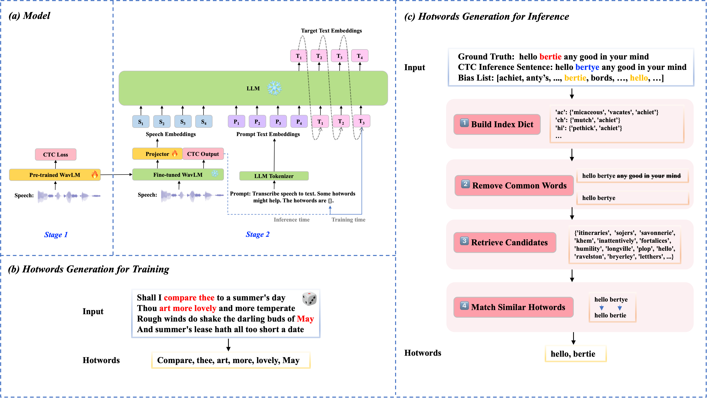
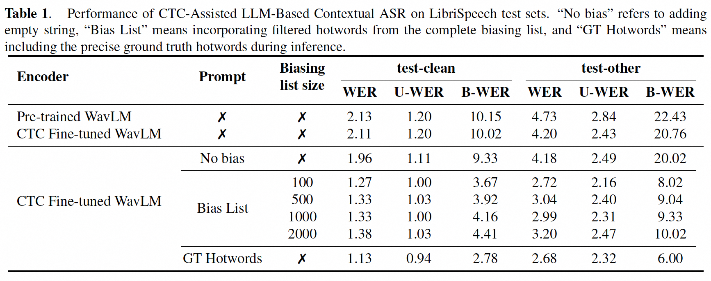

# CTC-Assisted LLM-Based Contextual ASR

## Guides

[CTC-Assisted LLM-Based Contextual ASR](https://arxiv.org/abs/2411.06437) is an LLM-based contextual ASR model that first uses CTC decoding results to filter potential relevant hotwords from pre-defined hotwords list and then incorporate them into LLM prompt input to improve recognition of hotwords.

## Model Architecture

We use WavLM-Large model pre-trained on 94, 000 hours of data, and fine-tuned on 960h hours of Librispeech data with CTC loss, as our speech encoder. We use the public Vicuna 7B as our large language model decoder, and a simple-structured linear projector, consisting of a 1-D convolution layer and two linear layers as our adapter. Refer to our [paper](https://arxiv.org/pdf/2411.06437) for more details.



## Checkpoints
We only train the linear projector in this recipe.
Encoder | Projector | LLM 
|---|---|---|
[CTC Fine-tuned WavLM-Large](https://drive.google.com/file/d/12ZmSSbDvx73W0eK1wpUgajapCLhqh5DI/view?usp=drive_link)(~315.45M) | [Linear](https://drive.google.com/file/d/1Zlbsnz1YUWtYtt-yNyoPK5OhR30kwLfS/view?usp=drive_link)(~15.74M) | [vicuna-7b-v1.5](https://huggingface.co/lmsys/vicuna-7b-v1.5)(~6.7B)  

## Performance



## Data preparation
The artificial biasing list constructed in [Contextualized streaming end-to-end speech recognition with trie-based deep biasing and shallow fusion](https://arxiv.org/pdf/2104.02194) is utilized for contextual ASR testing. Refer to official [Repo](https://github.com/facebookresearch/fbai-speech/tree/main/is21_deep_bias).  
They categorize the 5,000 most frequent words in the Librispeech training corpus as common
words, with the remainder classified as rare words. The biasing list generated for the test set consists of two segments: rare words in the transcriptions, and distractors sampled from the 209.2K rare words vocabulary. Biasing lists of varying lengths are generated by incorporating N = {100, 500, 1000, 2000} distractors into the lists.


## Decoding with checkpoints
```
bash decode_wavlm_libri960_ft_char_hotwords_filter_N100_F3.sh
```

## Training the model
```
bash finetune_wavlm_libri960_ft_char_hotwords.sh
bash finetune_wavlm_libri960_ft_char.sh
```

##  Citation
You can refer to the paper for more results. 
```
@article{yang2024ctc,
  title={CTC-Assisted LLM-Based Contextual ASR},
  author={Yang, Guanrou and Ma, Ziyang and Gao, Zhifu and Zhang, Shiliang and Chen, Xie},
  journal={Proc. SLT},
  year={2024}
}
```


