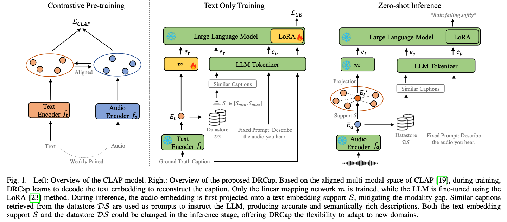

# DRCap_Zeroshot_Audio_Captioning

## Introduction
DRCap is a data-efficient and flexible audio captioning system requiring text-only data for training and can quickly adapt to new domains without additional fine-tuning. 



## Pretrained models 
You could download our pretrained CLAP model and linear mapping network through google drive: 
* [CLAP](https://drive.google.com/drive/folders/1d5RqM2OTxO8PD7qBUAyXXJHjS96XIauw?usp=sharing) pretrained on [SoundVECaps](https://yyua8222.github.io/Sound-VECaps-demo/) and [WavCaps](https://huggingface.co/datasets/cvssp/WavCaps) [~1.9M Audio-text pairs in total] 

* [Linear mapping network](https://drive.google.com/drive/folders/1d5RqM2OTxO8PD7qBUAyXXJHjS96XIauw?usp=sharing) trained on AudioCaps and Clotho_v2 via clap latents decoding and text-to-text retrieval augmentation. 
  
* LLM [vicuna-7b-v1.5](https://huggingface.co/lmsys/vicuna-7b-v1.5)

## Inference
You could modify the variables `run_dir`, `audio_encoder_dir`, `output_dir`, `llm_path` in `scripts/inference_drcap.sh` to match the paths where the downloaded checkpoints are located. Additionally, update the `source` in `data/audiocaps_test.jsonl` to ensure the audio paths point to your audio files, and then run:

```shell
bash scripts/inference_drcap.sh
```


## Data preparation
Prepare your `jsonl` data file in the following format:
```json
{"key": "Y7fmOlUlwoNg_1", "target": "Constant rattling noise and sharp vibrations", "text": "Constant rattling noise and sharp vibrations"}
{"key": "Y6BJ455B1aAs_1", "target": "A rocket flies by followed by a loud explosion and fire crackling as a truck engine runs idle", "text": "A rocket flies by followed by a loud explosion and fire crackling as a truck engine runs idle"}
```
Please note that only textual data is required for training. However, for zero-shot inference, audio files are also necessary. You could find an example of the jsonl file in `data/audiocaps_test.jsonl`

Run the following command to do the retrieval-augmentation and create the text embedding support for evaluation: 
```shell
bash scripts/data_preprocess.sh
``` 

## Model Training
You could run the following command to train the model
```bash
bash scripts/finetune_drcap.sh
```
For training only the linear layer (without using LoRA or other PEFT methods), you can set the following parameters: `use_peft=false` and `freeze_llm=true`. To turn off the RAG, you could set `use_arg=false` and `rag_first=false`

## Acknowledgement
The code of training the CLAP model is based on the [WavCaps](https://github.com/XinhaoMei/WavCaps) repo, we thank the contributors for open-sourcing their work.