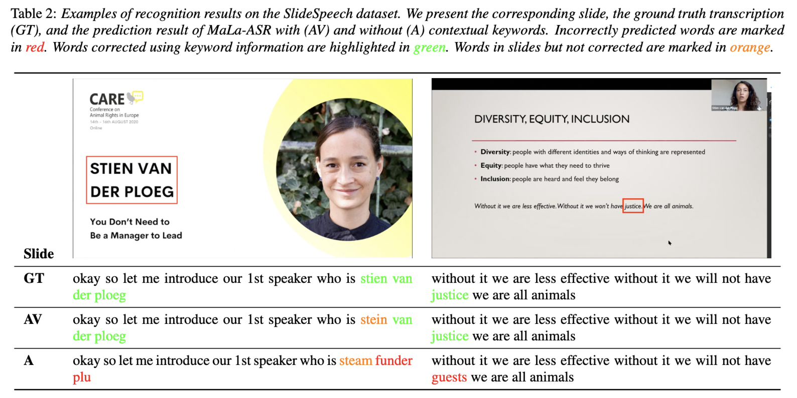
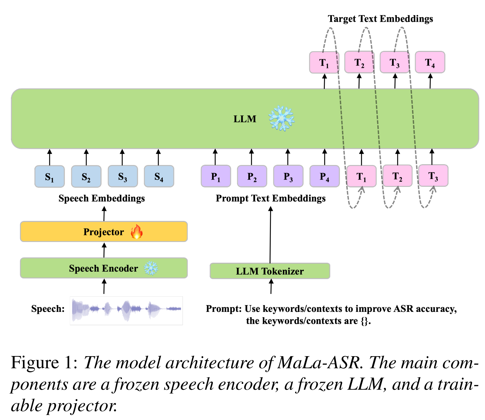

# MALA-ASR_SLIDESPEECH

## Guides

[MaLa-ASR](https://www.arxiv.org/abs/2406.05839) is an LLM-based ASR model that can integrate textual keywords extracted from presentation slides to improve recognition of conference content. 



## Model Architecture

We use the official WavLM-Large model as our speech encoder, the public Vicuna 7B as our large language model decoder, and a simple-structured linear projector, consisting of a 1-D convolution layer and two linear layers as our projector. Refer to the [paper](https://www.arxiv.org/abs/2406.05839) for more details.



## Performance and checkpoints
We only train the linear projector in this recipe.
Encoder | Projector | LLM | dev | test
|---|---|---|---|---|
[WavLM-large](https://drive.google.com/file/d/12-cB34qCTvByWT-QtOcZaqwwO21FLSqU/view) | [Linear](https://drive.google.com/file/d/1hYS5UI3W0WVOZRVbqWxDUWIFMO9VgzHk/view?usp=drive_link)(~15.74M) | [vicuna-7b-v1.5](https://huggingface.co/lmsys/vicuna-7b-v1.5) | 8.91 | 9.14 


## Data preparation
Refer to official [SLIDESPEECH CORPUS](https://slidespeech.github.io/)

The dataset requires four files: "my_wav.scp", "utt2num_samples", "text", "hot_related/ocr_1gram_top50_mmr070_hotwords_list".

"my_wav.scp" is a file of audio path lists. We transform wav file to ark file, so this file looks like:

```
ID1 xxx/slidespeech/dev_oracle_v1/data/format.1/data_wav.ark:22
ID2 xxx/slidespeech/dev_oracle_v1/data/format.1/data_wav.ark:90445
```

SLIDESPEECH provides "text" and a file named "keywords". The file "keywords" refers to "hot_related/ocr_1gram_top50_mmr070_hotwords_list", which contains hotwords lists.

"utt2num_samples" contains the length of the wavs, which looks like:

```
ID1 103680
ID2 181600
```

Please ensure that the order of all files is strictly consistent.

## Decode with checkpoints
```
bash decode_MaLa-ASR_withkeywords_L95.sh
```
Modify the path including `speech_encoder_path`, `llm_path`, `output_dir`, `ckpt_path` and `decode_log` in the script when you run the shell script. 

## Train a new model

### Use self-supervised model(such as WavLM) as the encoder
```
bash finetune_MaLa-ASR_withkeywords_L95.sh
```

##  Citation
You can refer to the paper for more results. 
```
@inproceedings{yang2024malaasr,
      title={MaLa-ASR: Multimedia-Assisted LLM-Based ASR}, 
      author={Guanrou Yang and Ziyang Ma and Fan Yu and Zhifu Gao and Shiliang Zhang and Xie Chen},
      booktitle={Proc. INTERSPEECH},
      year={2024},
}
```