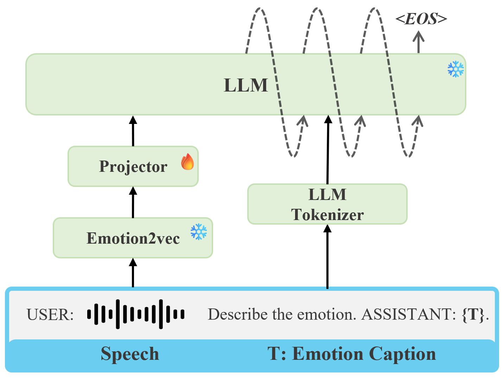

# Speech Emotion Caption

## Model Architecture

This recipe generates high-quality, human-like speech emotion descriptions. The model is based on the **q-former projector** and the **vicuna-7b-v1.5 LLM**. The model is trained on **an unpublished datasets** dataset, which is a large-scale dataset for speech emotion captioning.



## Performance and checkpoints

We only train the q-former projector in this recipe.

Encoder | Projector | LLM | Similarity Score 
---|---|---|---
[emotion2vec_base](https://huggingface.co/emotion2vec/emotion2vec_base) | [Q-Former](to_do)| [vicuna-7b-v1.5](https://huggingface.co/lmsys/vicuna-7b-v1.5) | 71.10

> **Note**: The baseline model [SECap](https://github.com/thuhcsi/SECap) was tested in our environment and achieved a similarity score of 71.52. Our model's score is slightly lower.

## Data preparation
You need to prepare the data jsonl in this format.

```
{"key": "key_name", "source": "path_to_wav_file", "target": "corresponding_caption"}
...
```


## Decode with checkpoints

```
bash decode_emotion2vec_qformer_vicuna_7b.sh
```

Modify the path including `speech_encoder_path`, `llm_path`, `output_dir`, `ckpt_path`, `val_data_path` and `decode_log` in the script when you run the shell script. 

## Train a new model

If you do have sufficient relevant data, you can train the model yourself.

```
bash finetune_emotion2vec_qformer_vicuna_7b.sh
```

##  Citation

You can refer to the paper for more results. 

```
@article{ma2024embarrassingly,
  title={An Embarrassingly Simple Approach for LLM with Strong ASR Capacity},
  author={Ma, Ziyang and Yang, Guanrou and Yang, Yifan and Gao, Zhifu and Wang, Jiaming and Du, Zhihao and Yu, Fan and Chen, Qian and Zheng, Siqi and Zhang, Shiliang and others},
  journal={arXiv preprint arXiv:2402.08846},
  year={2024}
}
```