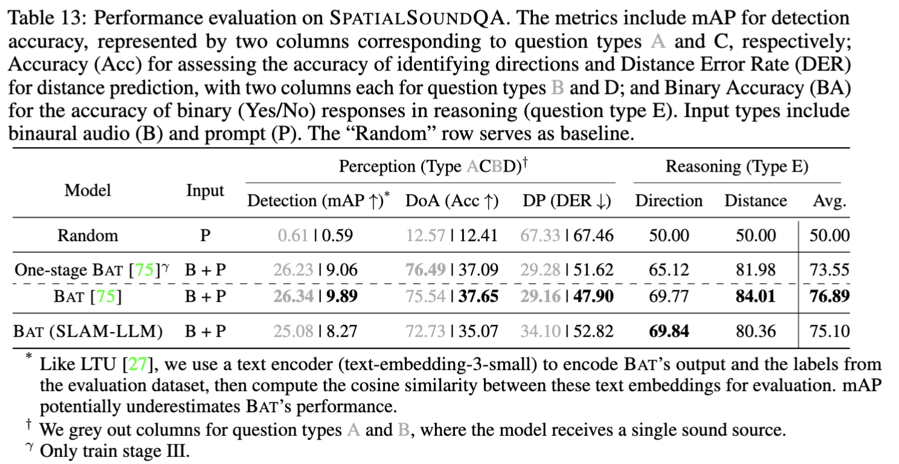

#  SELD_SpatialSoundQA

This repo hosts the code and models of "[BAT: Learning to Reason about Spatial Sounds with Large Language Models](https://arxiv.org/abs/2402.01591)" [ICML 2024 [bib](https://github.com/X-LANCE/SLAM-LLM/tree/main/examples/seld_spatialsoundqa#citation)]. 

Checkout our [demo page](https://zhishengzheng.com/BAT/) and enjoy a QA game with spatial audio.

## Performance evaluation on **SpatialSoundQA** 
We use [Spatial-AST](https://huggingface.co/datasets/zhisheng01/SpatialAudio/blob/main/SpatialAST/finetuned.pth) as audio encoder, [llama-2-7b](https://huggingface.co/meta-llama/Llama-2-7b) as LLM backbone. We finetune the model by adding Q-Former and LoRA. To calculate MAP, you can refer to [calculate_map.py](https://github.com/X-LANCE/SLAM-LLM/blob/main/examples/seld_spatialsoundqa/scripts/calculate_map.py)



## Demo (Spatial Audio Inference)
Try [`inference.ipynb`](https://github.com/X-LANCE/SLAM-LLM/blob/main/examples/seld_spatialsoundqa/inference.ipynb).


## Data preparation
You need to prepare the data jsonl in this format. Below is an example.  
You can download the SpatialSoundQA dataset from [SpatialAudio](https://huggingface.co/datasets/zhisheng01/SpatialAudio).
```json
{
  "audio_id": "eval/audio/YI-HlrcP6Qg4",
  "reverb_id": "q9vSo1VnCiC/0.npy", 
  "audio_id2": null, 
  "reverb_id2": null, 
  "question_id": 0, 
  "question_type": "CLASSIFICATION", 
  "question": "Enumerate the sound occurrences in the audio clip.", 
  "answer": "accelerating, revving, vroom; car; vehicle"
}

...

{
  "audio_id": "eval/audio/YZX2fVPmUidA", 
  "reverb_id": "q9vSo1VnCiC/32.npy", 
  "audio_id2": "eval/audio/YjNjUU01quLs", 
  "reverb_id2": "q9vSo1VnCiC/31.npy", 
  "question_id": 58, 
  "question_type": "MIXUP_NONBINARY_DISTANCE", 
  "question": "How far away is the sound of the banjo from the sound of the whack, thwack?", 
  "answer": "2m"
}
```

## Train a new model
```bash
cd examples/seld_spatialsoundqa/
bash scripts/finetune_spatial-ast_qformer_llama_2_7b.sh
```

## Decoding with checkpoints
```bash
cd examples/seld_spatialsoundqa/
bash scripts/decode_spatial-ast_qformer_llama_2_7b.sh
```


## TODO
- [x] Decode with checkpoints
- [x] Upload SpatialSoundQA dataset
- [x] Upload pretrained checkpoints
- [x] Update model performance

## Citation
```
@article{zheng2024bat,
  author    = {Zheng, Zhisheng and Peng, Puyuan and Ma, Ziyang and Chen, Xie and Choi, Eunsol and Harwath, David},
  title     = {BAT: Learning to Reason about Spatial Sounds with Large Language Models},
  journal   = {arXiv preprint arXiv:2402.01591},
  year      = {2024},
}
```