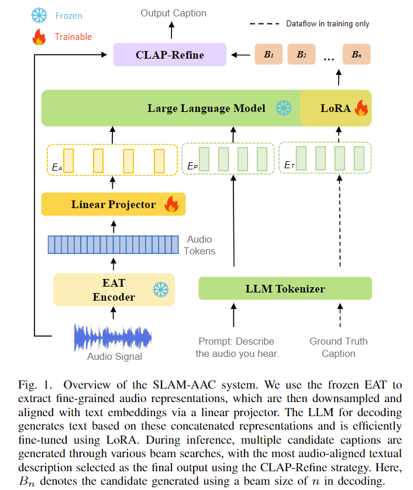

# SLAM-AAC

SLAM-AAC is a LLM-based model for Automated Audio Captioning (AAC) task. Inspired by techniques in machine translation and ASR, the model enhances audio captioning by incorporating paraphrasing augmentation and a plug-and-play CLAP-Refine strategy. For more details, please refer to the [paper](https://arxiv.org/abs/2410.09503).

## Model Architecture
SLAM-AAC uses EAT as the audio encoder and Vicuna-7B as the LLM decoder. During training, only the Linear Projector and LoRA modules are trainable. For inference, multiple candidates are generated using different beam sizes, which are then refined using the CLAP-Refine strategy.



## Performance and checkpoints
We have released the pre-trained checkpoint of SLAM-AAC, as well as the fine-tuned checkpoints for the Clotho and AudioCaps datasets. The provided checkpoints include the model's Linear Projector and LoRA modules. Please note that when using each component, be sure to set up the corresponding environments according to the instructions provided in the respective repositories (e.g., for [EAT](https://github.com/cwx-worst-one/EAT)).

### Pre-training
SLAM-AAC was pre-trained on a combination of AudioCaps, Clotho, WavCaps, and MACS datasets. For more information on these datasets, you can refer to [this repository](https://github.com/Labbeti/aac-datasets). Additionally, the Clotho dataset was augmented using a back-translation-based paraphrasing technique.  
Audio Encoder | LLM | Checkpoint | Pre-training Dataset|
|:---:|:---:|:---:|:---:|
[EAT-base (fine-tuned)](https://drive.google.com/file/d/1aCYiQmoZv_Gh1FxnR-CCWpNAp6DIJzn6/view?usp=sharing) |[vicuna-7b-v1.5](https://huggingface.co/lmsys/vicuna-7b-v1.5) | [link](https://drive.google.com/drive/folders/10kOjB112AeGYA_0mIUr8f1-i5rSg08_O?usp=sharing) | AudioCaps, Clotho, WavCaps, MACS |

### Fine-tuning
We fine-tuned the pre-trained model on the Clotho and AudioCaps datasets, respectively. The final evaluation was conducted using audio captions generated with the CLAP-Refine decoding strategy.
Dataset | Audio Encoder | LLM | Checkpoint | METEOR | CIDEr | SPICE | SPIDEr | SPIDEr-FL | FENSE
|:---:|:---:|:---:|:---:|:---:|:---:|:---:|:---:|:---:|:---:|
| Clotho | [EAT-base (fine-tuned)](https://drive.google.com/file/d/1aCYiQmoZv_Gh1FxnR-CCWpNAp6DIJzn6/view?usp=sharing) | [vicuna-7b-v1.5](https://huggingface.co/lmsys/vicuna-7b-v1.5) | [link](https://drive.google.com/drive/folders/1QX7CM9YAddPi02_NRChI5mzsNmBBtA63?usp=sharing) | 19.7 | 51.5 | 14.8 |33.2 | 33.0 | 54.0 |
| AudioCaps | [EAT-base (fine-tuned)](https://drive.google.com/file/d/1aCYiQmoZv_Gh1FxnR-CCWpNAp6DIJzn6/view?usp=sharing) | [vicuna-7b-v1.5](https://huggingface.co/lmsys/vicuna-7b-v1.5) | [link](https://drive.google.com/drive/folders/1GhFPiSVmBE9BvBhYWCEqkFuH-avKl-4g?usp=sharing) | 26.8 | 84.1 | 19.4 | 51.8 | 51.5 | 66.8 |


## Data preparation
Ensure your `jsonl` data follows the structure outlined below:
```json
{"key": "Y7fmOlUlwoNg_1", "source": "/root/data/AudioCaps/waveforms/test/Y7fmOlUlwoNg.wav", "target": "Constant rattling noise and sharp vibrations"}
{"key": "Y6BJ455B1aAs_1", "source": "/root/data/AudioCaps/waveforms/test/Y6BJ455B1aAs.wav", "target": "A rocket flies by followed by a loud explosion and fire crackling as a truck engine runs idle"}
```
In addition, you can refer to the [manifest](https://drive.google.com/drive/folders/1NJinoWg3yXKSPm-pRrhqKLvCD9dtDuDG?usp=sharing) file we've provided, which includes the Clotho dataset enhanced with **paraphrasing augmentation** as bonus.

## Model Training
To pre-train the SLAM-AAC model with pre-training data, you can run the following command:
```bash
# Pre-train the model
bash scripts/pretrain.sh
```

You can fine-tune the model on the AudioCaps or Clotho datasets using the [provided checkpoint](https://drive.google.com/drive/folders/10kOjB112AeGYA_0mIUr8f1-i5rSg08_O?usp=sharing) or your own pre-trained model by running the following commands:

```bash
# Fine-tune on AudioCaps
bash scripts/finetune_audiocaps.sh

# Fine-tune on Clotho
bash scripts/finetune_clotho.sh
```

You can also fine-tune the model without loading any pre-trained weights, though this may result in reduced performance.


### Note
- In the current version of SLAM-LLM, the `peft_ckpt` parameter is no longer required. However, if you are using the checkpoint provided by us, which was trained with an earlier version, please keep the `peft_ckpt` parameter in your configuration to ensure compatibility.
- Due to differences in dependency versions, there may be slight variations in the performance of the SLAM-AAC model.

## Inference
To perform inference with the trained models, you can use the following commands to decode using the common beam search method:
```bash
# Inference on AudioCaps (Beam Search)
bash scripts/inference_audiocaps_bs.sh

# Inference on Clotho (Beam Search)
bash scripts/inference_clotho_bs.sh
```

For improved inference results, you can use the CLAP-Refine strategy, which utilizes multiple beam search decoding. To use this method, you need to download and use our pre-trained [CLAP](https://drive.google.com/drive/folders/1X4NYE08N-kbOy6s_Itb0wBR_3X8oZF56?usp=sharing) model. Note that CLAP-Refine may take longer to run, but it can provide better quality outputs. You can execute the following commands:
```bash
# Inference on AudioCaps (CLAP-Refine)
bash scripts/inference_audiocaps_CLAP_Refine.sh

# Inference on Clotho (CLAP-Refine)
bash scripts/inference_clotho_CLAP_Refine.sh
```

If you already have the generated candidates and want to directly refine them using the CLAP-Refine strategy, you can run the following command:
```bash
bash scripts/clap_refine.sh
```

##  Citation
You can refer to the paper for more results. 
```
@article{chen2024slam,
  title={SLAM-AAC: Enhancing Audio Captioning with Paraphrasing Augmentation and CLAP-Refine through LLMs},
  author={Chen, Wenxi and Ma, Ziyang and Li, Xiquan and Xu, Xuenan and Liang, Yuzhe and Zheng, Zhisheng and Yu, Kai and Chen, Xie},
  journal={arXiv preprint arXiv:2410.09503},
  year={2024}
}
```
