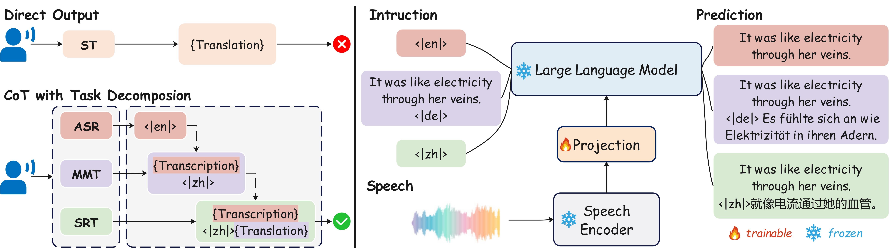
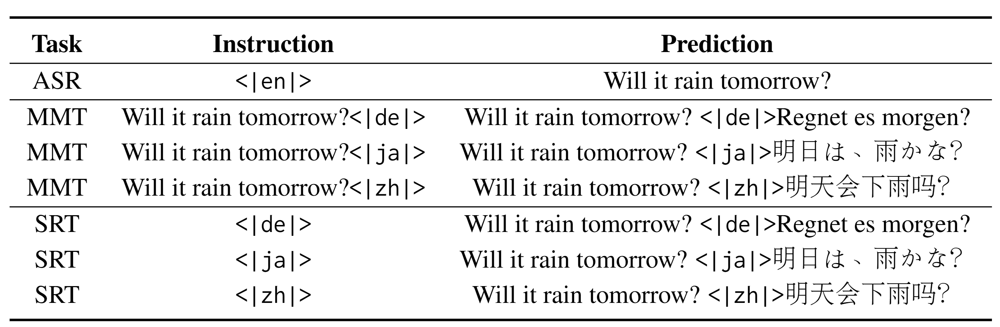

# ST_covost2


## Model Stracture



## Multitask 



## Installation
```
conda create -n cotst python=3.10
conda activate cotst

git clone https://github.com/ddlBoJack/SLAM-LLM.git
cd SLAM-LLM

pip install -e .
sudo apt install ffmpeg
pip install -U openai-whisper
pip install wandb
pip install soundfile
pip install evaluate
pip install transformers
pip install datasets
pip install sacrebleu
pip install jiwer
pip install librosa
pip install torch==2.4.0
pip install torchaudio==2.4.0
pip install torchvision==0.19.0
```

## Infer Demo
It is recommended to run on a single GPU for the first execution. Later, remove CUDA_VISIBLE_DEVICES=0, and it will automatically utilize all GPUs.

This demo will automatically download the model and dataset from Hugging Face, totaling approximately 100GB. Each card requires 128GB of RAM and 24GB of GPU memory.

#supported translation languages are Chinese (zh), German (de), and Japanese (ja).


```
CUDA_VISIBLE_DEVICES=0 bash examples/st_covost2/scripts/infer_enzh.sh zh
```


## Download Model 
We only train the q-former projector in this recipe.
Encoder | Projector | LLM 
|---|---|---
[whisper-large-v3](https://huggingface.co/openai/whisper-large-v3) | [q-former](https://huggingface.co/yxdu/cotst) | [Qwen2-7B](https://huggingface.co/Qwen/Qwen2-7B) 
```
git lfs clone https://huggingface.co/openai/whisper-large-v3
git lfs clone https://huggingface.co/yxdu/cotst
git lfs clone https://huggingface.co/Qwen/Qwen2-7B
```


## Data 
You need to download this dataset.
```
(https://github.com/facebookresearch/covost)
```


## Data preparation
You need to prepare the data jsonl in this format.  
You can find the test jsonl in "test_st.jsonl"
```
{"audio": "/userhome/speech/data/common/4/en/clips/common_voice_en_699711.mp3", "prompt": "<|en|>", "gt": "\"She'll be all right.\"", "source": "covost_en"}
{"audio": "/userhome/speech/data/common/4/en/clips/common_voice_en_699711.mp3", "prompt": "<|de|>", "gt": "\"She'll be all right.\"<|de|>Sie wird schon in Ordnung sein.", "source": "covost_ende"}
{"audio": "/userhome/speech/data/common/4/en/clips/common_voice_en_699711.mp3", "prompt": "<|ja|>", "gt": "\"She'll be all right.\"<|ja|>彼女は大丈夫だろう。", "source": "covost_enja"}
{"audio": "/userhome/speech/data/common/4/en/clips/common_voice_en_699711.mp3", "prompt": "<|zh|>", "gt": "\"She'll be all right.\"<|zh|>她会没事的。", "source": "covost_enzh"}
{"audio": "/userhome/speech/data/common/4/en/clips/common_voice_en_699711.mp3", "prompt": "\"She'll be all right.\"<|de|>", "gt": "\"She'll be all right.\"<|de|>Sie wird schon in Ordnung sein.", "source": "covost_enende"}
{"audio": "/userhome/speech/data/common/4/en/clips/common_voice_en_699711.mp3", "prompt": "\"She'll be all right.\"<|ja|>", "gt": "\"She'll be all right.\"<|ja|>彼女は大丈夫だろう。", "source": "covost_enenja"}
{"audio": "/userhome/speech/data/common/4/en/clips/common_voice_en_699711.mp3", "prompt": "\"She'll be all right.\"<|zh|>", "gt": "\"She'll be all right.\"<|zh|>她会没事的。", "source": "covost_enenzh"}
```
## Train Stage
Here, we have designed a three-step training process, where each training session uses the checkpoint obtained from the previous training session.
```
#In this step, we perform ASR pretraining to acquire speech recognition capabilities.
bash examples/st_covost2/scripts/asr_pretrain.sh


#monolingual MMT,SRT training and multitask training. 
#You can change the task type by modifying the value of **source** in the script.
bash examples/st_covost2/scripts/all.sh
```


##  Citation
You can refer to the paper for more results. 
```
@misc{du2024cotstenhancingllmbasedspeech,
      title={CoT-ST: Enhancing LLM-based Speech Translation with Multimodal Chain-of-Thought}, 
      author={Yexing Du and Ziyang Ma and Yifan Yang and Keqi Deng and Xie Chen and Bo Yang and Yang Xiang and Ming Liu and Bing Qin},
      year={2024},
      eprint={2409.19510},
      archivePrefix={arXiv},
      primaryClass={cs.CL},
      url={https://arxiv.org/abs/2409.19510}, 
}
```